# D-BPP Workflow

[](https://github.com/yangyang9608/D-BPP_Workflow/actions/workflows/ci.yml)
[](https://github.com/yangyang9608/D-BPP_Workflow/releases/latest)
[](LICENSE)
[](https://doi.org/10.5281/zenodo.22139143)

D-BPP is an expert-guided command-line workflow for reconstructing reticulate evolutionary histories from *D*-statistic signals and multispecies coalescent with introgression (MSci) analyses in BPP. It organizes candidate species-tree screening, construction of a joint candidate MSci model for each unexplained triple, Bayes-factor filtering, explained-triple pruning, iterative transfer of supported reticulations, and optional marginal-likelihood comparison among final networks obtained from alternative candidate species trees. Optional upstream modules are provided for annotation curation and gene-content species-tree construction; D-BPP itself does not require gene-content data and can evaluate candidate species-tree hypotheses from other sources.

D-BPP is designed for relatively small taxon sets whose candidate networks can be inspected explicitly. It is a model-construction aid, not an automatic biological decision system: users must inspect MCMC convergence, edit BPP priors and run settings, resolve conflicting network edges, and compare biologically plausible alternatives.

## Workflow overview

```mermaid
flowchart LR
    G["Genome assemblies<br/>+ annotations"]
    H["Annotation curation<br/>AGAT / BEDTools / gffread"]
    I["Curated proteomes"]
    J["Gene-content tree<br/>OrthoFinder → matrix → IQ-TREE"]
    T["Candidate species tree(s)"]
    A["Aligned loci or VCF"]
    B["D-step<br/>Dsuite screening"]
    C["Candidates<br/>Ranked significant triples"]
    D["BPP-step<br/>Construct candidate MSci model"]
    E["BPP<br/>Posterior estimation"]
    K["BPP-step<br/>B10 filtering and state update"]
    R["Update cumulative network<br/>retain supported events<br/>remove unsupported events<br/>mark initiating triple tested"]
    X["Reclassify triples explained<br/>by the supported network"]
    U{"Significant triples remain<br/>pending in the queue?"}
    F["Final supported<br/>MSci network"]

    G --> H --> I --> J --> T
    T --> B
    A --> B
    B --> C --> D --> E --> K --> R --> X --> U
    U -- "Yes" --> D
    U -- "No" --> F

    classDef upstream fill:#F3F7FB,stroke:#7A8FA6,stroke-width:1.3px,color:#1F2D3D;
    classDef input fill:#EAF4FF,stroke:#4A90E2,stroke-width:1.5px,color:#1F2D3D;
    classDef process fill:#EEF7EE,stroke:#5C9E6E,stroke-width:1.5px,color:#1F2D3D;
    classDef decision fill:#FFF6E8,stroke:#D9A441,stroke-width:1.5px,color:#1F2D3D;
    classDef output fill:#F4ECFF,stroke:#8B6FCF,stroke-width:1.5px,color:#1F2D3D;

    class G,H,I,J upstream;
    class T,A input;
    class B,C,D,E,K,R process;
    class U decision;
    class F output;
```



For the highest-ranked unexplained triple in the form `((P1,P2),P3)`, `BPP-step.sh` augments the current network with three candidate events in one MSci model: ghost introgression to P1 and both sampled-lineage directions between P2 and P3. The two sampled-lineage directions are encoded jointly as bidirectional introgression, while the ghost hypothesis is encoded as a separate unidirectional event.

Supported events are retained, triples classified as explained by the updated network are skipped, and the procedure advances to the next highest-ranked eligible signal. Each successive candidate model is built on the cumulative network of reticulations that remain supported after evaluation of the preceding model, while previously introduced reticulations are reassessed in subsequent models. A round with no newly supported event therefore does not reset or terminate the analysis: the initiating triple is marked as tested, unsupported new events are removed, and the next candidate triple is added to the retained supported network. With `--fbranch`, compatible descendant triples can be used to propose an ancestral rather than terminal placement; such placements require user review.

## Requirements

| Dependency | Purpose | When required |
|---|---|---|
| Bash 4+ | shell workflow | always |
| Python 3.10+ | final-model tree normalization, B₁₀ and marginal-likelihood utilities | BPP-step finalization and post-processing |
| [Dsuite](https://github.com/millanek/Dsuite) | *D*-statistic calculation | D-step |
| [BPP 4.8.7](https://github.com/bpp/bpp/releases/tag/v4.8.7) | MSci model construction and inference | BPP-step |
| [Newick Utilities](https://github.com/tjunier/newick_utils) | tree validation and clade operations | both steps |
| [snp-sites](https://github.com/sanger-pathogens/snp-sites) | FASTA-to-VCF conversion | D-step with `--fasta_dir` |
| Perl | internal-node and tree-string processing | BPP-step |

For the supported Linux x86_64 installation, `environment.yml` supplies the core runtime and build tools, and `scripts/install_external.sh` installs the release-pinned BPP and Dsuite builds into the active Conda environment. Manual `PATH` editing is therefore not required for the standard installation. See [`INSTALL.md`](INSTALL.md) for other platforms.

## Optional upstream species-tree workflow

The [`upstream/`](upstream/) directory separates optional preparation and inference of candidate species trees into two modules:

1. [`upstream/annotation_curation`](upstream/annotation_curation) converts genome assemblies plus protein-coding annotations into curated proteomes using AGAT, BEDTools, gffread, SeqKit, and small Python utilities.
2. [`upstream/gene_content_tree`](upstream/gene_content_tree) starts from curated proteomes, infers orthogroups with OrthoFinder, converts gene counts to binary presence–absence matrices, and infers candidate species trees with IQ-TREE.

This separation is intentional. Annotation curation is a preprocessing step, whereas gene-content tree construction is a phylogenetic inference step. Either module can be replaced by user-supplied alternatives, and neither is required by D-BPP.

Additional dependencies are:

| Dependency | Purpose |
|---|---|
| [AGAT](https://agat.readthedocs.io/) | GFF3 parsing/repair and longest-isoform retention |
| [BEDTools](https://bedtools.readthedocs.io/) | connected components of overlapping coding spans |
| [gffread](https://github.com/gpertea/gffread) | CDS and protein extraction |
| [SeqKit](https://bioinf.shenwei.me/seqkit/) | configurable minimum protein-length filtering |
| [OrthoFinder](https://orthofinder.github.io/OrthoFinder/) | orthogroup inference |
| [IQ-TREE](https://iqtree.github.io/) | gene-content species-tree inference |

See the [upstream overview](upstream/README.md), [annotation-curation README](upstream/annotation_curation/README.md), and [gene-content tree README](upstream/gene_content_tree/README.md) for inputs, commands, and outputs.

Manuscript-specific perturbation and robustness analyses are intentionally excluded from the public workflow.

## Installation

For the supported Linux x86_64 installation, the full runtime can be prepared with the following commands:

```bash
git clone https://github.com/yangyang9608/D-BPP_Workflow.git
cd D-BPP_Workflow
conda env create -f environment.yml
conda activate dbpp
bash scripts/install_external.sh
bash scripts/check_dependencies.sh
```

`environment.yml` supplies Bash >=4.4, Python 3.10, Perl, SNP-sites 2.5.1, Newick Utilities 1.6, Git, Make, a C++ compiler, zlib, wget and tar. By default, `scripts/install_external.sh` installs the **release-pinned environment** used for D-BPP Workflow v1.2: **BPP 4.8.7** and **Dsuite 0.5 r58 at Git commit `a547f99599d763c1760548191ea3f62cc58e8ac3`**. Exact alternatives can be selected with the `BPP_VERSION` and `DSUITE_COMMIT` environment variables, and `--latest` is available for compatibility testing against the current BPP release and Dsuite HEAD. The installer records which mode and versions were actually installed. Run `DBPP_VERSION=v1.2 bash scripts/record_versions.sh` to save the exact executable paths, versions, and Dsuite revision used. See [`INSTALL.md`](INSTALL.md) for details and platform notes.

For exact reproduction of the v1.2 software environment, use the default installer with no version overrides:

```bash
bash scripts/install_external.sh
```

To test a specific newer BPP release without changing the v1.2 default, for example:

```bash
BPP_VERSION=4.9.0 bash scripts/install_external.sh
```

To test the current upstream external dependencies:

```bash
bash scripts/install_external.sh --latest
```

`--latest` is intentionally **not** the reproducibility default; it is a compatibility-testing mode and should be followed by the bundled dependency checks and automated tests before production analyses.

A compact synthetic example is available in [`examples/`](examples/). It contains 20 aligned loci for three ingroup species and one outgroup and can be used to run the workflow from D-statistic screening through first-round MSci model construction. The example is intended for software verification rather than biological validation, assessment of statistical power, or MCMC convergence.

The full datasets associated with the published *Panthera* and *Thuja* analyses are archived on [Dryad](https://doi.org/10.5061/dryad.47d7wm3sr).

For users starting from genome assemblies and annotations, the optional [`upstream/`](upstream/) workflow can curate annotations and generate candidate gene-content species trees before the D-step.

## Inputs

### Sequence or variant data

- **Multi-locus FASTA directory**: one aligned `.fa`, `.fas`, or `.fasta` file per locus. Sequence identifiers are the first whitespace-delimited token after `>`. D-step retains only loci containing every individual in the IMAP file; BPP-step retains loci containing at least two ingroup individuals.
- **VCF**: accepted by D-step only. Sample identifiers must match the IMAP file.
- **BPP multi-locus PHYLIP**: accepted by BPP-step only. Sequence identifiers must be `species^individual`. The built-in validator expects the name and sequence on the same line; use `--skip_validation` only for a valid BPP file that was checked independently.

### IMAP file

The IMAP file has no header and contains exactly two whitespace-delimited columns: individual and species. Outgroup samples must use the case-sensitive species label `Outgroup`.

```text
a1  A
a2  A
b1  B
b2  B
c1  C
c2  C
o1  Outgroup
```

Use the original IMAP file in every D-BPP round. `BPP.imap`, generated by the workflow, excludes the outgroup and is passed internally to BPP.

### Candidate-tree list

Provide one semicolon-terminated Newick tree per non-comment line. Exclude the outgroup, and use species names matching the IMAP file.

```text
((A,B),C);
(A,(B,C));
```

## Quick start

The commands below use illustrative `data/...` paths for user-supplied datasets. For a copy-paste runnable example using the bundled synthetic data, see [`examples/README.md`](examples/README.md).

### 1. Screen candidate species trees with Dsuite

From a FASTA directory:

```bash
./D-step.sh \
  --fasta_dir data/loci \
  --imap data/Test.imap \
  --treelist data/Test.treelist \
  --prefix results/D-step/Sig-D \
  --cutoff 0.01
```

Or from a VCF:

```bash
./D-step.sh \
  --vcf_file data/Test.vcf \
  --imap data/Test.imap \
  --treelist data/Test.treelist \
  --prefix results/D-step/Sig-D \
  --cutoff 0.01
```

For candidate tree 1, the main outputs are:

```text
results/D-step/Sig-D-Tree1.tree
results/D-step/Sig-D-Tree1.sig-triples
results/D-step/Sig-D-Tree1.Dsuite.log
```

Raw *P* values are Bonferroni-adjusted by the number of ingroup species triples, `choose(n, 3)`, and capped at 1. Significant triples are ranked by

```text
Dₚ = (ABBA - BABA) / (BBAA + ABBA + BABA).
```

### 2. Generate the first BPP model

```bash
mkdir -p results/BPP-step
./BPP-step.sh \
  --fasta_dir data/loci \
  --imap data/Test.imap \
  --tree results/D-step/Sig-D-Tree1.tree \
  --dstat results/D-step/Sig-D-Tree1.sig-triples \
  --prefix results/BPP-step/round1 \
  2> results/BPP-step/round1.log
```

This creates:

| File | Purpose |
|---|---|
| `results/BPP-step/BPP.phy` | ingroup multi-locus PHYLIP generated from FASTA |
| `results/BPP-step/BPP.imap` | BPP mapping without outgroup samples |
| `round1.introgression` | tested event-to-ϕ-label mapping |
| `round1.triple-state.tsv` | ranked-triple state ledger (`candidate`, `pending`, `explained`, or `tested`) |
| `round1.msci` | BPP MSci-generator definitions |
| `round1.ctl` | editable BPP control-file template |

Before running BPP, inspect `round1.msci` and edit the control file for the data. At minimum, check `nloci`, `phase`, `Threads`, `thetaprior`, `tauprior`, `burnin`, `sampfreq`, and `nsample`.

```bash
bpp --cfile results/BPP-step/round1.ctl
```

Do not advance to another round until replicate chains, effective sample sizes, traces, and parameter estimates indicate adequate MCMC performance.

### 3. Evaluate the preceding round and continue

```bash
./BPP-step.sh \
  --phylip_file results/BPP-step/BPP.phy \
  --imap data/Test.imap \
  --tree results/D-step/Sig-D-Tree1.tree \
  --dstat results/D-step/Sig-D-Tree1.sig-triples \
  --prefix results/BPP-step/round2 \
  --last_step results/BPP-step/round1 \
  --skip_validation \
  --b10_cutoff 100 \
  2> results/BPP-step/round2.log
```

If another model is generated, edit its control file, run BPP, and repeat. Every successive model contains all reticulations that remain supported after evaluation of the preceding model, plus the three candidates generated for the next eligible triple. A round in which none of those three newly introduced events passes the B₁₀ cutoff does **not** terminate the workflow or reset the network. Instead, the initiating triple is recorded as `tested`, its unsupported new events are removed, and the next highest-ranked significant triple that is neither currently explained nor previously tested is evaluated on the retained supported network.

Iteration stops only when no significant triple remains in the candidate queue. Thus, every significant triple has either been classified as explained by the currently supported network or individually evaluated. The round-specific `*.triple-state.tsv` file records this state explicitly. If unsupported events must be removed from the last evaluated model when the queue becomes empty, the reduced supported network is written as `final.msci`, `final.ctl`, and `final.introgression`; otherwise, the last evaluated model is reported as the final supported model. A `final.triple-state.tsv` record is written when the search is complete. If no introgression event is supported after all candidate triples have been evaluated, the final model is the input species tree without reticulations.

Warnings about multiple events involving the same tree edge require manual revision of the `.msci` and `.introgression` files before inference.

### 4. Optional ancestral-branch aggregation

Add `--fbranch` to a first or subsequent BPP-step command to search for a monophyletic ancestral branch whose descendant triples all occur in the ranked *D*-statistic results. This rule changes model construction and should be checked against the focal phylogeny and sampling design.

## B₁₀ calculation

With the default BPP `phiprior = 1 1`, D-BPP uses the small-interval Savage-Dickey approximation

```text
B₁₀,ε = Pr(ϕ < ε) / Pr(ϕ < ε | X) = ε / Pr(ϕ < ε | X).
```

`BPP-step.sh` uses `epsilon = 0.01` and `B10 cutoff = 100` by default; both are user-configurable with `--eps` and `--b10_cutoff`. If `phiprior` is changed from `1 1`, supply the corresponding prior probability with `--prior_mass` rather than using ε as the numerator.

The standalone `cal_b10.py` utility reports both `epsilon = 0.01` and `epsilon = 0.001` by default, making the sensitivity of support to the near-zero interval explicit:

```bash
python3 cal_b10.py \
  results/BPP-step/round1.mcmc.txt \
  results/BPP-step/round1.b10.tsv
```

This creates a compact wide summary (`round1.b10.tsv`) and a long-format details table (`round1.b10.details.tsv`) containing the epsilon value, prior mass, posterior mass below epsilon, sample counts, B₁₀ and support classification. To evaluate only selected intervals, repeat `--epsilon`; for a non-Uniform phi prior, provide the prior interval mass explicitly, for example `--prior-mass 0.01=0.025`.

## Log marginal likelihood

Marginal-likelihood comparison is optional. If only one candidate species tree is analyzed, the workflow ends with the final supported network for that topology. If multiple candidate species trees are considered, complete the full D-BPP iteration independently for each topology first, then compare the resulting final networks using the same sequence data and consistent priors for shared parameters.

BPP generates Gaussian-quadrature power-posterior control files with `--bfdriver`. D-BPP v1.2 separates execution records from numerical results through four subcommands. Run each final network in its own working directory.

### 1. Prepare integration points

```bash
python3 cal_marginal_likelihoods.py prepare model.ctl \
  --points 16 \
  --run-dir marginal_likelihood_run
```

This calls `bpp --bfdriver`, records the generated control files, and writes `bfdriver.log` plus `bfdriver_manifest.tsv` under the run-record directory.

### 2. Run the power-posterior analyses

```bash
python3 cal_marginal_likelihoods.py run "model.b*.ctl" \
  --jobs 1 \
  --run-dir marginal_likelihood_run
```

The command stores screen logs under `marginal_likelihood_run/logs/` and writes a `run_manifest.tsv` containing the control file, log file, return code, elapsed time and UTC timestamps. Increase `--jobs` only when the requested BPP processes and their internal thread settings fit the available resources.

### 3. Summarize one final network

After all power-posterior runs finish, calculate

```text
log p(X | M) ≈ 1/2 × sum(weight_i × E_beta_i[log p(X | theta)]).
```

```bash
python3 cal_marginal_likelihoods.py summarize \
  model.ctl.betaweights.csv \
  --run-dir marginal_likelihood_run \
  --label Tree1_final_network \
  --output-dir marginal_likelihood_results
```

By default, the summarizer reads the screen logs listed in `marginal_likelihood_run/run_manifest.tsv`, which is the output stream in which BPP reports `BFbeta` and `E_b(lnf(X))`. It rejects failed, missing or duplicate integration points, verifies the Gauss-Legendre weights, matches rounded BPP beta values within a configurable tolerance, and writes three result files: `integration_points.tsv`, `marginal_likelihood.tsv`, and `marginal_likelihood_report.txt`. A quoted output glob can still be supplied explicitly for externally generated runs, and older whitespace-delimited `betaweights.txt` files are also accepted.

### 4. Compare final networks

After summarizing each candidate species tree separately, compare the final networks with:

```bash
python3 cal_marginal_likelihoods.py compare \
  tree1_results/marginal_likelihood.tsv \
  tree2_results/marginal_likelihood.tsv \
  --output-dir marginal_likelihood_comparison
```

The comparison table ranks models by log marginal likelihood and reports the log-marginal-likelihood difference from the best model. The older three-positional-argument calculator syntax remains available for backward compatibility.

## Testing

```bash
for f in D-step.sh BPP-step.sh scripts/*.sh upstream/annotation_curation/*.sh upstream/gene_content_tree/*.sh; do
  bash -n "$f"
done
python3 -m py_compile cal_b10.py cal_marginal_likelihoods.py upstream/annotation_curation/scripts/*.py upstream/gene_content_tree/scripts/*.py
python3 -m unittest discover -s tests -v
```

The test suite uses small synthetic fixtures to test core workflow logic, annotation-curation utilities, and gene-content matrix construction. It does not replace empirical validation with real BPP, Dsuite, AGAT, OrthoFinder, or IQ-TREE analyses.

## Interpretation and limitations

- Gene-content species-tree inference is sensitive to annotation completeness and systematic annotation differences; it should be treated as one candidate species-tree strategy rather than an automatic guarantee of the true species tree.
- Significant *D*-statistics identify imbalance, not a unique direction, donor, or biological mechanism.
- Ghost-lineage placement is a candidate explanation requiring model comparison and biological scrutiny.
- Automatically generated models are not exhaustive and can be incompatible when multiple events share an edge.
- Results depend on the candidate species tree, taxon sampling, data filtering, priors, and MCMC adequacy.
- Record software versions, random seeds, control files, convergence diagnostics, and all manual model edits for reproducibility.

## Citation

If you use D-BPP Workflow, please cite the software release used and the associated methods article.

### Software

Current release: **D-BPP Workflow v1.2**. The repository is connected to the all-versions Zenodo concept DOI [https://doi.org/10.5281/zenodo.22139143](https://doi.org/10.5281/zenodo.22139143). After v1.2 is archived, cite the **version-specific v1.2 DOI** shown on the Zenodo record; this DOI should also be used in the Bioinformatics manuscript.

Repository citation metadata are provided in [`CITATION.cff`](CITATION.cff).

### Associated methods article

Yang Y, Pang XX, Ding YM, Zhang BW, Bai WN, Zhang DY. 2026. Synergizing Bayesian and heuristic approaches: D-BPP uncovers ghost introgression in *Panthera* and *Thuja*. *Systematic Biology*, syag012. [https://doi.org/10.1093/sysbio/syag012](https://doi.org/10.1093/sysbio/syag012)

## License and contact

D-BPP Workflow is released under the [MIT License](LICENSE). Questions and reproducible bug reports can be sent to `yangy@mail.bnu.edu.cn` or opened through GitHub Issues.
