# D-BPP Workflow

[](https://github.com/yangyang9608/D-BPP_Workflow/actions/workflows/ci.yml)
[](https://github.com/yangyang9608/D-BPP_Workflow/releases/latest)
[](LICENSE)
[](https://doi.org/10.5281/zenodo.22139144)

D-BPP is an expert-guided command-line workflow for reconstructing reticulate evolutionary histories from *D*-statistic signals and multispecies coalescent with introgression (MSci) analyses in BPP. It organizes candidate-tree screening, three-model tests for each unexplained triple, Bayes-factor filtering, explained-triple pruning, and optional marginal-likelihood comparison. Optional upstream modules are provided for annotation curation and gene-content species-tree construction; D-BPP itself does not require gene-content data and can evaluate alternative backbone hypotheses from other sources.

The workflow is intended primarily for datasets with fewer than 10 taxa. It is a model-construction aid, not an automatic biological decision system: users must inspect MCMC convergence, edit BPP priors and run settings, resolve conflicting network edges, and compare biologically plausible alternatives.

## Workflow overview

```mermaid
flowchart LR
    G["Genome assemblies<br/>+ annotations"]
    H["Annotation curation<br/>AGAT / BEDTools / gffread"]
    I["Curated proteomes"]
    J["Gene-content tree<br/>OrthoFinder → matrix → IQ-TREE"]
    T["Candidate backbone tree(s)"]
    A["Aligned loci or VCF"]
    B["D-step<br/>Dsuite screening"]
    C["Candidates<br/>Ranked significant triples"]
    D["BPP-step<br/>Three event models per triple"]
    E{"Explained or unsupported?"}
    F["Output<br/>Expert-reviewed MSci model"]

    G --> H --> I --> J --> T
    T --> B
    A --> B
    B --> C --> D --> E
    E -- "No" --> D
    E -- "Yes" --> F

    classDef upstream fill:#F3F7FB,stroke:#7A8FA6,stroke-width:1.3px,color:#1F2D3D;
    classDef input fill:#EAF4FF,stroke:#4A90E2,stroke-width:1.5px,color:#1F2D3D;
    classDef process fill:#EEF7EE,stroke:#5C9E6E,stroke-width:1.5px,color:#1F2D3D;
    classDef decision fill:#FFF6E8,stroke:#D9A441,stroke-width:1.5px,color:#1F2D3D;
    classDef output fill:#F4ECFF,stroke:#8B6FCF,stroke-width:1.5px,color:#1F2D3D;

    class G,H,I,J upstream;
    class T,A input;
    class B,C,D process;
    class E decision;
    class F output;
```



For the highest-ranked unexplained triple in the form `((P1,P2),P3)`, `BPP-step.sh` constructs models representing:

1. ghost introgression to P1;
2. introgression from P2 to P3; and
3. introgression from P3 to P2.

Supported events are retained, the triples they explain are removed, and the procedure advances to the next unexplained signal. With `--fbranch`, monophyletic sets sharing *D*-statistic patterns can be represented by ancestral rather than terminal branches.

## Requirements

| Dependency | Purpose | When required |
|---|---|---|
| Bash 4+ | shell workflow | always |
| Python 3.10+ | B₁₀ and marginal-likelihood utilities | post-processing |
| [Dsuite](https://github.com/millanek/Dsuite) | *D*-statistic calculation | D-step |
| [BPP 4.8.x](https://github.com/bpp/bpp) | MSci model construction and inference | BPP-step |
| [Newick Utilities](https://github.com/tjunier/newick_utils) | tree validation and clade operations | both steps |
| [snp-sites](https://github.com/sanger-pathogens/snp-sites) | FASTA-to-VCF conversion | D-step with `--fasta_dir` |
| Perl | internal-node and tree-string processing | BPP-step |

Add the directories containing the executables to `PATH`. For example:

```bash
export PATH_BPP="/path/to/bpp-directory"
export PATH_DSUITE="/path/to/Dsuite/Build"
export PATH_SNP_SITES="/path/to/snp-sites/bin"
export PATH_NEWICK_UTILS="/path/to/newick_utils/src"
export PATH="$PATH_BPP:$PATH_DSUITE:$PATH_SNP_SITES:$PATH_NEWICK_UTILS:$PATH"
```

Confirm the installation before starting:

```bash
command -v bpp Dsuite nw_display nw_clade nw_labels nw_prune
command -v snp-sites  # required only for FASTA input in D-step
```

## Optional upstream backbone workflow

The [`upstream/`](upstream/) directory separates optional backbone preparation into two modules:

1. [`upstream/annotation_curation`](upstream/annotation_curation) converts genome assemblies plus protein-coding annotations into curated proteomes using AGAT, BEDTools, gffread, SeqKit, and small Python utilities.
2. [`upstream/gene_content_tree`](upstream/gene_content_tree) starts from curated proteomes, infers orthogroups with OrthoFinder, converts gene counts to binary presence–absence matrices, and infers candidate species trees with IQ-TREE.

This separation is intentional. Annotation curation is a preprocessing step, whereas gene-content tree construction is a phylogenetic inference step. Either module can be replaced by user-supplied alternatives, and neither is required by D-BPP.

Additional dependencies are:

| Dependency | Purpose |
|---|---|
| [AGAT](https://agat.readthedocs.io/) | GFF3 parsing/repair and longest-isoform retention |
| [BEDTools](https://bedtools.readthedocs.io/) | connected components of overlapping coding spans |
| [gffread](https://github.com/gpertea/gffread) | CDS and protein extraction |
| [SeqKit](https://bioinf.shenwei.me/seqkit/) | configurable minimum protein-length filtering |
| [OrthoFinder](https://orthofinder.github.io/OrthoFinder/) | orthogroup inference |
| [IQ-TREE](https://iqtree.github.io/) | gene-content species-tree inference |

See the [upstream overview](upstream/README.md), [annotation-curation README](upstream/annotation_curation/README.md), and [gene-content tree README](upstream/gene_content_tree/README.md) for inputs, commands, and outputs.

Manuscript-specific perturbation and robustness analyses are intentionally excluded from the public workflow.

## Installation

```bash
git clone https://github.com/yangyang9608/D-BPP_Workflow.git
cd D-BPP_Workflow
chmod +x D-step.sh BPP-step.sh cal_b10.py cal_marginal_likelihoods.py
chmod +x upstream/annotation_curation/*.sh upstream/annotation_curation/scripts/*.py
chmod +x upstream/gene_content_tree/*.sh upstream/gene_content_tree/scripts/*.py
./D-step.sh --help
./BPP-step.sh --help
```

The scripts use only the Python standard library; no Python package installation is required.

A compact synthetic example is available in [`examples/minimal`](examples/minimal). It contains five 500-bp loci and two sampled individuals per ingroup species, and can be used to check input formatting and first-round BPP control-file generation. It is not a biological validation dataset.

The full datasets associated with the published *Panthera* and *Thuja* analyses are archived on [Dryad](https://doi.org/10.5061/dryad.47d7wm3sr).

For users starting from genome assemblies and annotations, the optional [`upstream/`](upstream/) workflow can curate annotations and generate candidate gene-content backbones before the D-step.

## Inputs

### Sequence or variant data

- **Multi-locus FASTA directory**: one aligned `.fa`, `.fas`, or `.fasta` file per locus. Sequence identifiers are the first whitespace-delimited token after `>`. D-step retains only loci containing every individual in the IMAP file; BPP-step retains loci containing at least two ingroup individuals.
- **VCF**: accepted by D-step only. Sample identifiers must match the IMAP file.
- **BPP multi-locus PHYLIP**: accepted by BPP-step only. Sequence identifiers must be `species^individual`. The built-in validator expects the name and sequence on the same line; use `--skip_validation` only for a valid BPP file that was checked independently.

### IMAP file

The IMAP file has no header and contains exactly two whitespace-delimited columns: individual and species. Outgroup samples must use the case-sensitive species label `Outgroup`.

```text
a1  A
a2  A
b1  B
b2  B
c1  C
c2  C
o1  Outgroup
```

Use the original IMAP file in every D-BPP round. `BPP.imap`, generated by the workflow, excludes the outgroup and is passed internally to BPP.

### Candidate-tree list

Provide one semicolon-terminated Newick tree per non-comment line. Exclude the outgroup, and use species names matching the IMAP file.

```text
((A,B),C);
(A,(B,C));
```

## Quick start

### 1. Screen candidate backbones with Dsuite

From a FASTA directory:

```bash
./D-step.sh \
  --fasta_dir data/loci \
  --imap data/Test.imap \
  --treelist data/Test.treelist \
  --prefix results/D-step/Sig-D \
  --cutoff 0.01
```

Or from a VCF:

```bash
./D-step.sh \
  --vcf_file data/Test.vcf \
  --imap data/Test.imap \
  --treelist data/Test.treelist \
  --prefix results/D-step/Sig-D \
  --cutoff 0.01
```

For candidate tree 1, the main outputs are:

```text
results/D-step/Sig-D-Tree1.tree
results/D-step/Sig-D-Tree1.sig-triples
results/D-step/Sig-D-Tree1.Dsuite.log
```

Raw *P* values are Bonferroni-adjusted by the number of ingroup species triples, `choose(n, 3)`, and capped at 1. Significant triples are ranked by

```text
Dₚ = (ABBA - BABA) / (BBAA + ABBA + BABA).
```

### 2. Generate the first BPP model

```bash
mkdir -p results/BPP-step
./BPP-step.sh \
  --fasta_dir data/loci \
  --imap data/Test.imap \
  --tree results/D-step/Sig-D-Tree1.tree \
  --dstat results/D-step/Sig-D-Tree1.sig-triples \
  --prefix results/BPP-step/round1 \
  2> results/BPP-step/round1.log
```

This creates:

| File | Purpose |
|---|---|
| `results/BPP-step/BPP.phy` | ingroup multi-locus PHYLIP generated from FASTA |
| `results/BPP-step/BPP.imap` | BPP mapping without outgroup samples |
| `round1.introgression` | tested event-to-ϕ-label mapping |
| `round1.msci` | BPP MSci-generator definitions |
| `round1.ctl` | editable BPP control-file template |

Before running BPP, inspect `round1.msci` and edit the control file for the data. At minimum, check `nloci`, `phase`, `Threads`, `thetaprior`, `tauprior`, `burnin`, `sampfreq`, and `nsample`.

```bash
bpp --cfile results/BPP-step/round1.ctl
```

Do not advance to another round until replicate chains, effective sample sizes, traces, and parameter estimates indicate adequate MCMC performance.

### 3. Evaluate the preceding round and continue

```bash
./BPP-step.sh \
  --phylip_file results/BPP-step/BPP.phy \
  --imap data/Test.imap \
  --tree results/D-step/Sig-D-Tree1.tree \
  --dstat results/D-step/Sig-D-Tree1.sig-triples \
  --prefix results/BPP-step/round2 \
  --last_step results/BPP-step/round1 \
  --skip_validation \
  --eps 0.01 \
  --b10_cutoff 100 \
  2> results/BPP-step/round2.log
```

If another model is generated, edit its control file, run BPP, and repeat. The script returns exit status 0 for normal stopping conditions, including:

- none of the three newly added events passes the B₁₀ cutoff;
- every significant *D*-statistic triple is explained; or
- the *D*-statistic file contains no significant triple.

Warnings about multiple events involving the same tree edge require manual revision of the `.msci` and `.introgression` files before inference.

### 4. Optional ancestral-branch aggregation

Add `--fbranch` to a first or subsequent BPP-step command to search for a monophyletic ancestral branch whose descendant triples all occur in the ranked *D*-statistic results. This rule changes model construction and should be checked against the focal phylogeny and sampling design.

## B₁₀ calculation

With the default BPP `phiprior = 1 1`, D-BPP approximates support for introgression as

```text
B₁₀ = ε / Pr(ϕ < ε | data).
```

The workflow and standalone utility both default to `epsilon = 0.001`. In the worked examples below, we explicitly use `epsilon = 0.01`:

```bash
python3 cal_b10.py \
  results/BPP-step/round1.mcmc.txt \
  results/BPP-step/round1.b10.tsv \
  --epsilon 0.01
```

The shortcut assumes a Uniform(0, 1) prior. If `phiprior` is changed, the prior probability of the near-zero interval must be recalculated rather than replaced by ε.

## Log marginal likelihood

Use BPP to generate Gaussian-quadrature control files and run every power-posterior point:

```bash
bpp --bfdriver model.ctl --points 16
```

After all runs finish, calculate

```text
log p(X | M) ≈ 1/2 × sum(weight_i × E_beta_i[log p(X | theta)]).
```

```bash
python3 cal_marginal_likelihoods.py \
  model.ctl.betaweights.csv \
  "model-*.out" \
  model.log-marginal-likelihood.txt
```

The utility rejects missing or duplicate integration points, verifies that the Gauss-Legendre weights sum to 2, and matches rounded BPP beta values with an absolute tolerance of `1e-6`. Adjust the latter only when necessary with `--beta-tolerance`.

## Testing

```bash
bash -n D-step.sh BPP-step.sh upstream/annotation_curation/*.sh upstream/gene_content_tree/*.sh
python3 -m py_compile cal_b10.py cal_marginal_likelihoods.py upstream/annotation_curation/scripts/*.py upstream/gene_content_tree/scripts/*.py
python3 -m unittest discover -s tests -v
```

The test suite uses small synthetic fixtures to test core workflow logic, annotation-curation utilities, and gene-content matrix construction. It does not replace empirical validation with real BPP, Dsuite, AGAT, OrthoFinder, or IQ-TREE analyses.

## Interpretation and limitations

- Gene-content backbone inference is sensitive to annotation completeness and systematic annotation differences; it should be treated as one candidate-backbone strategy rather than an automatic guarantee of the true species tree.
- Significant *D*-statistics identify imbalance, not a unique direction, donor, or biological mechanism.
- Ghost-lineage placement is a candidate explanation requiring model comparison and biological scrutiny.
- Automatically generated models are not exhaustive and can be incompatible when multiple events share an edge.
- Results depend on the candidate backbone, taxon sampling, data filtering, priors, and MCMC adequacy.
- Record software versions, random seeds, control files, convergence diagnostics, and all manual model edits for reproducibility.

## Citation

If you use D-BPP Workflow, please cite the software release used and the associated methods article.

### Software

Zenodo archives each GitHub release and assigns a version-specific DOI. The all-versions concept DOI for D-BPP Workflow is [https://doi.org/10.5281/zenodo.22139144](https://doi.org/10.5281/zenodo.22139144). For reproducible analyses, cite the version-specific DOI corresponding to the release used.

The archived v1.0.1 release is available at [https://doi.org/10.5281/zenodo.22139143](https://doi.org/10.5281/zenodo.22139143). The v1.1.0 release will receive its own version-specific DOI automatically when the GitHub release is published.

### Associated methods article

Yang Y, Pang XX, Ding YM, Zhang BW, Bai WN, Zhang DY. 2026. Synergizing Bayesian and heuristic approaches: D-BPP uncovers ghost introgression in *Panthera* and *Thuja*. *Systematic Biology*, syag012. [https://doi.org/10.1093/sysbio/syag012](https://doi.org/10.1093/sysbio/syag012)

Repository citation metadata are provided in [`CITATION.cff`](CITATION.cff).

## License and contact

D-BPP Workflow is released under the [MIT License](LICENSE). Questions and reproducible bug reports can be sent to `yangy@mail.bnu.edu.cn` or opened through GitHub Issues.
